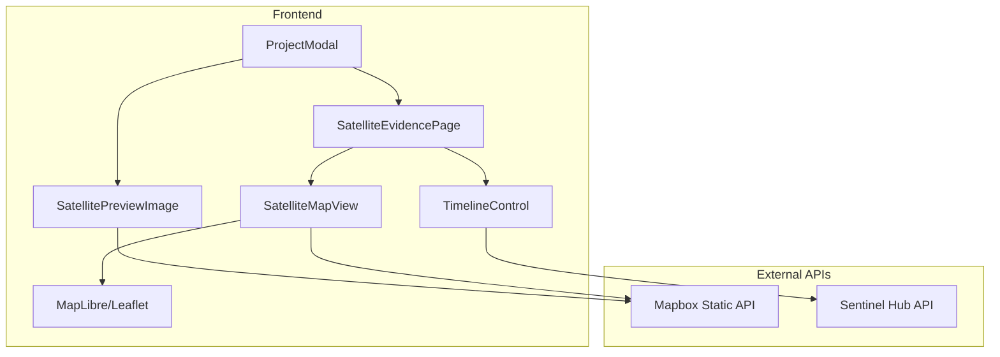

# Design Document: Satellite Project Viewer

## Overview

The Satellite Project Viewer feature enhances the HYDRA platform's investigation capabilities by integrating real-time and historical satellite imagery. This feature modifies the existing ProjectModal component to display location-specific satellite previews and introduces a new Satellite Evidence Page with timeline-based historical imagery viewing.

The implementation leverages the Mapbox Static Images API for satellite imagery, which provides:
- High-resolution satellite imagery
- Global coverage including the Philippines
- Simple URL-based image retrieval using coordinates
- No complex authentication for static images (uses access token)

For historical imagery, we'll integrate with Sentinel Hub or use Mapbox's satellite layer with date parameters where available. As a fallback, we'll use Google Earth Engine Timelapse embeds for historical context.

## Architecture



### Data Flow

1. **ProjectModal** receives project data with `latitude` and `longitude`
2. **SatellitePreviewImage** constructs Mapbox Static API URL using coordinates
3. **View Satellite Evidence** button navigates to `/satellite/:projectId`
4. **SatelliteEvidencePage** fetches project details and renders full satellite view
5. **TimelineControl** allows date selection, triggering imagery updates

## Components and Interfaces

### 1. SatellitePreviewImage Component

```typescript
interface SatellitePreviewImageProps {
  latitude: number;
  longitude: number;
  projectName: string;
  zoom?: number;        // Default: 15
  width?: number;       // Default: 600
  height?: number;      // Default: 300
}

interface SatellitePreviewState {
  isLoading: boolean;
  hasError: boolean;
  imageUrl: string | null;
}
```

**Responsibilities:**
- Generate Mapbox Static API URL from coordinates
- Handle loading and error states
- Display project name overlay
- Provide fallback placeholder on error

### 2. SatelliteEvidencePage Component

```typescript
interface SatelliteEvidencePageProps {
  // Route params
  projectId: string;
}

interface SatelliteEvidencePageState {
  project: Project | null;
  selectedDate: Date;
  isLoading: boolean;
  error: string | null;
  availableDates: Date[];
}
```

**Responsibilities:**
- Fetch project details from API
- Render full-screen satellite map
- Manage timeline state
- Handle navigation back to map

### 3. TimelineControl Component

```typescript
interface TimelineControlProps {
  startDate: Date;
  endDate: Date;
  selectedDate: Date;
  onDateChange: (date: Date) => void;
  availableDates?: Date[];
}
```

**Responsibilities:**
- Render date range slider
- Display reference markers (project start, current date)
- Emit date change events
- Show nearest available date indicator

### 4. SatelliteMapView Component

```typescript
interface SatelliteMapViewProps {
  latitude: number;
  longitude: number;
  zoom: number;
  date?: Date;
  onZoomChange?: (zoom: number) => void;
}
```

**Responsibilities:**
- Render interactive satellite map using Leaflet/MapLibre
- Support zoom and pan controls
- Update imagery based on selected date
- Handle full-screen mode

## Data Models

### Project (Extended)

```typescript
interface Project {
  id: number;
  name: string;
  contractor: string;
  latitude: number;
  longitude: number;
  budget: string;
  start_date: string;
  end_date: string;
  status: string;
  risk: 'Critical' | 'High' | 'Low' | 'Indeterminate';
  score: number;
  risk_description: string;
  region?: string;
  province?: string;
  municipality?: string;
}
```

### Satellite Image Configuration

```typescript
interface SatelliteConfig {
  mapboxAccessToken: string;
  defaultZoom: number;
  minZoom: number;
  maxZoom: number;
  imageWidth: number;
  imageHeight: number;
}
```


## Correctness Properties

*A property is a characteristic or behavior that should hold true across all valid executions of a system-essentially, a formal statement about what the system should do. Properties serve as the bridge between human-readable specifications and machine-verifiable correctness guarantees.*

### Property 1: Satellite URL Generation Correctness

*For any* valid latitude and longitude coordinate pair, the generated Mapbox Static API URL SHALL contain those exact coordinates in the correct format (longitude,latitude).

**Validates: Requirements 1.1**

### Property 2: Project Name Overlay Rendering

*For any* project with a non-empty name, the rendered SatellitePreviewImage component SHALL include the project name in its output.

**Validates: Requirements 1.5**

### Property 3: Navigation Route Correctness

*For any* project with a valid ID, clicking the "View Satellite Evidence" button SHALL trigger navigation to a route containing that project's ID.

**Validates: Requirements 2.1**

### Property 4: Project Header Information Display

*For any* project loaded on the Satellite Evidence Page, the rendered header SHALL contain the project name and contractor information.

**Validates: Requirements 2.2**

### Property 5: Map Center Coordinates

*For any* project with valid coordinates, the SatelliteMapView component SHALL receive those exact coordinates as its center point.

**Validates: Requirements 2.3**

### Property 6: Timeline Date Selection Updates View

*For any* date selected within the valid range (project start date to current date), the satellite view SHALL receive that date as a parameter for imagery retrieval.

**Validates: Requirements 3.2**

### Property 7: Timeline Reference Markers

*For any* project with a start date, the TimelineControl SHALL display markers indicating both the project start date and the current date.

**Validates: Requirements 3.4**

## Error Handling

### Image Loading Errors

1. **Network Failure**: Display placeholder with "Unable to load satellite imagery" message and retry button
2. **Invalid Coordinates**: Show placeholder with "Location data unavailable" message
3. **API Rate Limiting**: Queue requests and show loading state, retry with exponential backoff

### API Errors

1. **Project Not Found (404)**: Navigate back to map with toast notification
2. **Server Error (500)**: Display error page with retry option
3. **Timeout**: Show timeout message with manual retry button

### Historical Imagery Errors

1. **Date Not Available**: Fall back to nearest available date, show notification
2. **No Historical Data**: Display current imagery with "Historical data unavailable" message

## Testing Strategy

### Unit Testing

Unit tests will cover:
- URL generation utility functions
- Date formatting and validation
- Component rendering with various props
- Error state handling

Testing Framework: **Vitest** with **React Testing Library**

### Property-Based Testing

Property-based tests will use **fast-check** library to verify:
- Coordinate-to-URL transformation correctness
- Date range validation
- Component prop handling across input ranges

Each property-based test MUST:
- Run a minimum of 100 iterations
- Be tagged with the format: `**Feature: satellite-project-viewer, Property {number}: {property_text}**`
- Reference the specific correctness property from this design document

### Integration Testing

Integration tests will verify:
- Navigation flow from ProjectModal to SatelliteEvidencePage
- API integration with mock server
- Timeline interaction with map updates

## API Integration

### Mapbox Static Images API

**Base URL**: `https://api.mapbox.com/styles/v1/mapbox/satellite-v9/static`

**URL Format**:
```
{baseUrl}/{longitude},{latitude},{zoom},{bearing},{pitch}/{width}x{height}?access_token={token}
```

**Example**:
```
https://api.mapbox.com/styles/v1/mapbox/satellite-v9/static/121.7740,12.8797,15,0,0/600x300?access_token=YOUR_TOKEN
```

### Environment Configuration

```javascript
// .env
VITE_MAPBOX_ACCESS_TOKEN=pk.your_mapbox_token_here
```

### Satellite Tile Layer (for interactive map)

```javascript
const satelliteTileUrl = `https://api.mapbox.com/styles/v1/mapbox/satellite-streets-v12/tiles/{z}/{x}/{y}?access_token=${token}`;
```

## File Structure

```
frontend/src/
├── components/
│   └── Dashboard/
│       ├── ProjectModal.jsx (modified)
│       └── SatellitePreviewImage.jsx (new)
├── pages/
│   └── SatelliteEvidence.jsx (new)
├── components/
│   └── Satellite/
│       ├── SatelliteMapView.jsx (new)
│       └── TimelineControl.jsx (new)
├── utils/
│   └── satelliteUtils.js (new)
└── __tests__/
    └── satellite.property.test.jsx (new)
```
